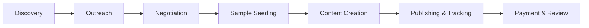

# Product Requirement Document (PRD): KOL Connection Middleware

| Document Version | 1.0 |
| :--- | :--- |
| **Project Name** | KOL Connection Middleware (Influencer Marketing System) |
| **Status** | Draft |
| **Author** | Trae AI (Product Manager Agent) |
| **Last Updated** | 2026-02-25 |

---

## 1. Product Overview
### 1.1 Background
As cross-border e-commerce grows, managing hundreds of influencers via spreadsheets is inefficient. We need a centralized system to discover, manage, and track global influencers (TikTok, Instagram, YouTube) to drive traffic and sales.

### 1.2 Product Goal
Build a scalable "Influencer Operating System" that:
1.  **Efficiency**: Reduces time spent on influencer outreach and sample management by 50%.
2.  **Data-Driven**: Matches influencers based on data (VOC insights) rather than intuition.
3.  **Transparency**: Tracks every dollar spent vs. GMV generated (ROI attribution).

### 1.3 Scope
*   **In Scope**: Influencer CRM, Campaign Management, Sample Logistics, Affiliate Link Tracking, Data Dashboard.
*   **Out of Scope**: Direct payment processing (integration only), Social Media Content Posting (API limitation).

---

## 2. User Roles
| Role | Responsibilities | Key Needs |
| :--- | :--- | :--- |
| **Influencer Manager (IM)** | Sources and contacts influencers. | "I need to quickly filter 100 beauty creators in UK." |
| **Marketing Lead** | Plans campaigns and budgets. | "I need to see the ROI of the 'Summer Sale' campaign." |
| **Logistics Specialist** | Ships samples to influencers. | "I need to know where to ship and update tracking numbers." |
| **Influencer (External)** | Receives products, posts content. | "I need to know what to say (Brief) and where is my package." |

---

## 3. Business Process

---

## 4. Functional Requirements

### 4.1 Module: Influencer Discovery (The "Pool")
**User Story**: As an IM, I want to search influencers by region, category, and engagement rate so I can find the right match.

*   **F1.1 Multi-Filter Search**:
    *   Filters: Platform (TikTok/IG/YT), Country, Category (Beauty/Tech/Fashion), Followers (Nano/Micro/Macro), Avg. Views.
*   **F1.2 Influencer Profile Card**:
    *   Display: Avatar, Handle, Bio, Engagement Rate (ER), Est. Cost.
    *   **VOC Insight Tag**: System auto-tags "Good for Waterproof" based on their past content analysis.
*   **F1.3 Bulk Import**: Support uploading Excel/CSV to populate the database.

### 4.2 Module: Campaign Management (The "Workspace")
**User Story**: As a Marketing Lead, I want to manage a "Black Friday" campaign with 50 influencers in one Kanban board.

*   **F2.1 Kanban View**:
    *   Columns: `Potential` -> `Contacted` -> `Sample Sent` -> `Content Pending` -> `Published` -> `Completed`.
*   **F2.2 Smart Brief Generator**:
    *   Input: Product Name.
    *   **AI Feature**: Auto-pull "Selling Points" from VOC system (e.g., "Mention the 24h battery life").
    *   Output: A generated PDF/Link Brief for the influencer.

### 4.3 Module: Sample Management (The "Logistics")
**User Story**: As a Logistics Specialist, I want to see a list of pending sample requests so I can ship them out.

*   **F3.1 Sample Request Form**: IM submits request (SKU, Qty, Influencer Address).
*   **F3.2 Logistics Tracking**:
    *   Integration with 17Track/FedEx API.
    *   Auto-update status: `Dispatched` -> `In Transit` -> `Delivered`.
    *   **Trigger**: When `Delivered`, auto-email Influencer: "Your package arrived! Can't wait to see your video."

### 4.4 Module: Data Analytics (The "Scoreboard")
**User Story**: As a Lead, I want to see which influencer drove the most sales.

*   **F4.1 Affiliate Link Generator**:
    *   Generate unique `utm_source` links for each influencer/campaign.
*   **F4.2 Performance Table**:
    *   Columns: Influencer Name, Clicks, Conversion Rate, GMV, Cost, ROI.
    *   Highlight "Top Performers" (Green) and "Underperformers" (Red).

---

## 5. Non-Functional Requirements
*   **Performance**: Influencer list load time < 2 seconds (for 10k+ records).
*   **Security**: Mask influencer's personal address/phone number for non-logistics staff.
*   **Compatibility**: Web-based (Desktop optimized for Managers, Mobile optimized for Influencer portal).

---

## 6. Figma Prototype Guidance (for Designers)
Since I cannot directly operate Figma, please use the following structure to draw the wireframes:

### Page 1: Dashboard (Home)
*   **Top Cards**: Total Influencers, Active Campaigns, Monthly GMV, Samples In-Transit.
*   **Chart**: Traffic Trend (Line chart).
*   **List**: "Urgent Tasks" (e.g., 5 samples need approval).

### Page 2: Influencer Discovery
*   **Left Sidebar**: Filters (Region: US/UK, Platform: TikTok).
*   **Main Area**: Grid of Cards. Each card has:
    *   Round Avatar.
    *   Name & Handle (@jessica_style).
    *   Stats: 50k Followers | 5.2% ER.
    *   Tags: #Fashion #Moms.
    *   Action Button: "Add to Campaign".

### Page 3: Campaign Kanban
*   **Header**: Campaign Name, Date Range, Budget.
*   **Board**: 5 Columns (Contacted, Seeding, Posting...).
*   **Cards**: Draggable influencer cards.

### Page 4: Influencer Profile Detail
*   **Header**: Basic Info & Contact Buttons.
*   **Tabs**: `Overview`, `Content History`, `Sample Log`, `Performance`.
*   **Content History**: Grid of their recent TikTok thumbnails.
