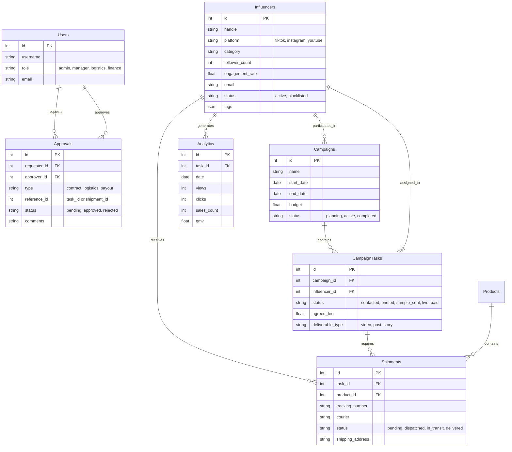

# KOL Middleware Database Schema Design

This document outlines the entity-relationship model and table definitions for the KOL Connection Middleware system.

## 1. Entity Relationship Diagram (ERD) Overview

## 2. Table Definitions (SQL Draft)

### 2.1 Core Tables

#### `users`
| Column | Type | Description |
| :--- | :--- | :--- |
| `id` | SERIAL PRIMARY KEY | Unique ID |
| `username` | VARCHAR(50) | Login name |
| `role` | VARCHAR(20) | Permission level (Manager, Logistics, Finance) |

#### `influencers`
| Column | Type | Description |
| :--- | :--- | :--- |
| `id` | SERIAL PRIMARY KEY | Unique ID |
| `handle` | VARCHAR(100) | Social media handle (e.g. @jessica) |
| `platform` | VARCHAR(20) | TikTok, Instagram, YouTube |
| `category` | VARCHAR(50) | Beauty, Tech, Home |
| `er_rate` | FLOAT | Engagement Rate (e.g. 0.05 for 5%) |

#### `campaign_tasks` (The central work unit)
| Column | Type | Description |
| :--- | :--- | :--- |
| `id` | SERIAL PRIMARY KEY | Unique ID |
| `campaign_id` | INT FK | Link to Campaign |
| `influencer_id` | INT FK | Link to Influencer |
| `status` | VARCHAR(20) | `to_contact`, `brief_sent`, `sample_sent`, `live` |
| `fee` | DECIMAL(10, 2) | Agreed payment amount |

### 2.2 Logistics & Approval

#### `shipments`
| Column | Type | Description |
| :--- | :--- | :--- |
| `id` | SERIAL PRIMARY KEY | Unique ID |
| `task_id` | INT FK | Which task/influencer needs this? |
| `tracking_no` | VARCHAR(100) | FedEx/DHL tracking number |
| `status` | VARCHAR(20) | `pending_approval`, `shipped`, `delivered` |

#### `approvals`
| Column | Type | Description |
| :--- | :--- | :--- |
| `id` | SERIAL PRIMARY KEY | Unique ID |
| `type` | VARCHAR(20) | `contract` (Manager), `shipping` (Logistics), `payment` (Finance) |
| `status` | VARCHAR(20) | `pending`, `approved`, `rejected` |
| `payload` | JSONB | Snapshot of data being approved (e.g. cost, address) |

## 3. API Endpoints Plan

*   `GET /influencers`: List all influencers with filters.
*   `POST /influencers`: Add new influencer.
*   `GET /campaigns/{id}/tasks`: Get Kanban board data.
*   `POST /shipments`: Create shipment request (triggers approval).
*   `POST /approvals/{id}/{action}`: Approve or Reject a request.
